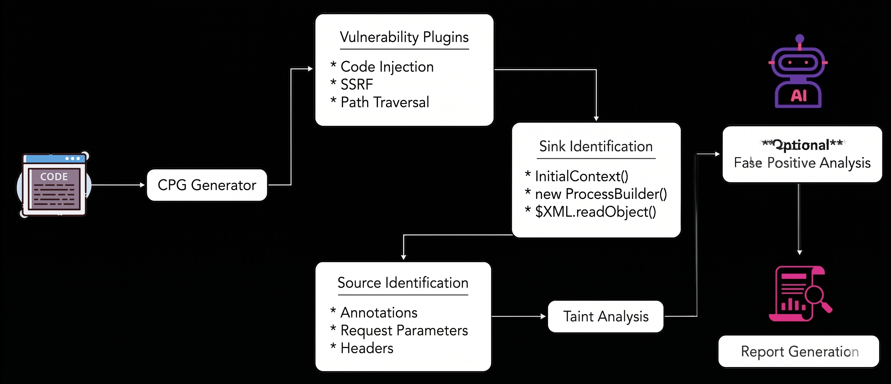

  

**NIKA** is an open-source static code analyzer that is capable of performing a **cross-file taint analysis** to identify security vulnerabilities.

### Who is this for?

* Product Security teams looking to automate security scanning for microservices.
* Security Engineers performing gray-box and white-box security assessments.

### Skip the Docs, Get Running Fast

If you want to quickly get started with Nika, follow the [Installation Guide](./installation-guide.md).

### Language Support Matrix

| Language | Current Support |
|---|---|
| Java | ✅ Fully Supported |
| Python | 🚧 Planned |
| C/C++  | 🚧 Planned |

### Tool Workflow

  

* The source code repository is first processed to generate a **Code Property Graph (CPG)**, which provides a unified representation of the code structure, control flow, and data flow for analysis.

* Vulnerability-specific plugins define the required **sources, sinks, and propagation patterns** for different vulnerability classes such as SSRF, Code Injection, and Path Traversal.

* The engine identifies dangerous **sink functions** such as command execution, XML deserialization, database queries, and outbound network calls.

* The framework identifies **attack-controlled input sources** such as API annotations, request parameters, headers, and other externally influenced inputs.

* Using taint analysis, the system traces whether untrusted input can flow from identified sources to security-sensitive sinks across files and functions.

* The taint engine performs **cross-file and inter-procedural analysis** to identify realistic exploit paths rather than isolated code patterns.

* Detected findings are passed through an **AI-assisted false positive analysis layer** to improve accuracy and reduce noisy results.

* The final stage generates a structured vulnerability report containing the vulnerable flow, source-to-sink path, affected files/functions, and remediation guidance.

### What vulnerabilities does it cover ? 

| Issue | Description |
|---|---|
| `command_injection` | Flags OS command execution sinks such as `Runtime.exec(...)` and `ProcessBuilder.start()` when attacker-controlled input can influence commands or arguments. |
| `code_injection` | Flags dynamic expression/code evaluation sinks such as `ScriptEngine.eval(...)`, OGNL, Java EL, and `MVEL.executeExpression(...)` when expressions are built from untrusted input. |
| `order_scan` | Flags security-critical call-order violations in sensitive execution flows and validation chains. |
| `sqli` | Flags SQL/HQL query construction using string concatenation or dynamic builders that reach execution sinks across JDBC, Spring, Hibernate, JPA, jOOQ, and related frameworks. |
| `path_traversal` | Flags user-controlled filesystem path construction and file access sinks such as `File`, `Paths.get(...)`, `FileInputStream`, and related APIs. |
| `ssrf` | Flags outbound request and URL construction sinks across Java core libraries and HTTP clients including `HttpURLConnection`, `RestTemplate`, `WebClient`, `OkHttp`, Apache HttpClient, and others. |
| `template_injection` | Flags Server-Side Template Injection (SSTI) sinks where templates are dynamically compiled or evaluated from untrusted input. |
| `deserialization` | Flags unsafe object deserialization and polymorphic object materialization sinks such as `ObjectInputStream.readObject`, `XMLDecoder.readObject`, Jackson polymorphic typing, JNDI lookups, and related APIs. |
| `cryptographic_failure` | Flags weak or insecure cryptographic primitives, cipher modes, insecure randomness, JWT verification weaknesses, and static IV/key reuse patterns. |
| `unsafe_reflection` | Flags reflective class loading using attacker-controlled or non-literal class names through APIs such as `Class.forName(...)`. |
| `xxe` | Flags XML parsing and transformation sinks that may allow external entity resolution across DOM, SAX, JAXB, XPath, XStream, and related XML processing libraries. |

